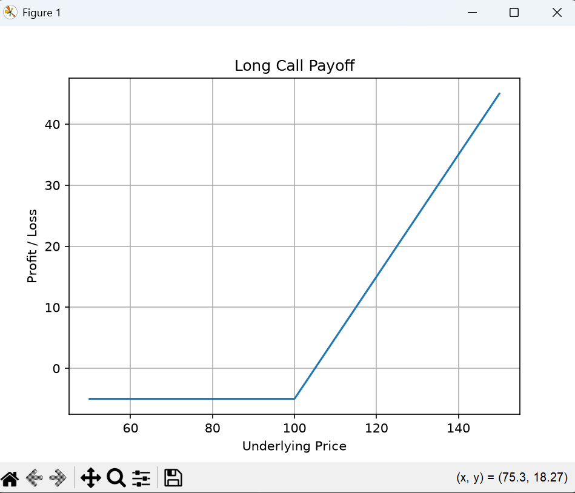

# Option Payoff Tool

Python application for modeling and visualizing option payoffs.

## Features

- Long Call
- Long Put
- Short Call
- Short Put
- Option strategies:
  - Straddle
  - Strangle
  - Bull Call Spread
  - Bear Put Spread
  - Butterfly

## Technologies

- Python
- NumPy
- Matplotlib

## Project Structure

```text
option-payoff-tool/
│
├── src/
│   ├── main.py
│   └── options.py
│
└── README.md
```

## Example

### Long Call

The payoff of a long call option is:

\[
\max(S-K,0)-Premium
\]

where:

- S = underlying price
- K = strike price

## Run the project

Clone the repository:

```bash
git clone https://github.com/yourusername/option-payoff-tool.git
```

Install dependencies:

```bash
pip install numpy matplotlib
```

Run:

```bash
python src/main.py
```

## Screenshot



## Future Improvements

- Black-Scholes pricing
- Greeks calculation
- Implied volatility solver
- Monte Carlo pricing
- Interactive dashboard

## Author

Théo Bogner